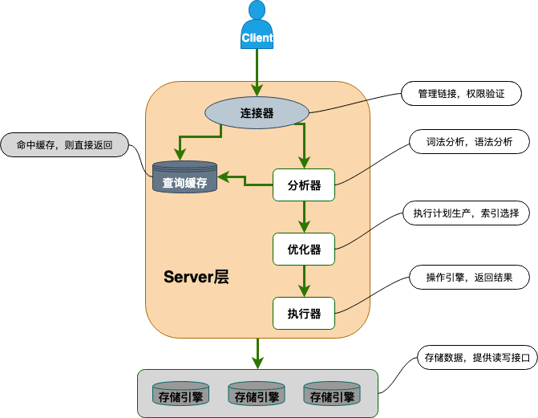

# 一、MySQL基础

## 1、数据库三大范式了解吗?
### 1NF：属性不可再分

属性（表中的字段）不可再分割，如地址：xxx省xxx市xxx县就不满足1NF的要求，因为可以再细分为省、市、县三个属性。

### 2NF：消除部分依赖

假设我们有一个存储员工信息的表，员工ID、姓名、部门、部门ID等，由于部门名称依赖于部门ID而不是整个员工ID，部门名称就部分依赖于部门ID。

| 员工ID（主键） | 姓名   | 部门ID（候选键） | 部门名称 |
|--------------|------|--------------|--------|
| 1            | 张三   | 101          | 研发部   |
| 2            | 李四   | 102          | 销售部   |
| 3            | 王五   | 101          | 研发部   |

好我们将原始表按照2NF进行分解，确保它满足2NF的要求。我们需要将部门名称从原始表中移出，以消除部分依赖。 这可以通过创建一个新的表来存储部门ID和部门名称的对应关系来实现。

**员工信息表（Employee）：**

| 员工ID（主键） | 姓名   | 部门ID（候选键） |
|--------------|------|--------------|
| 1            | 张三   | 101          |
| 2            | 李四   | 102          |
| 3            | 王五   | 101          |

**部门信息表（Department）：**

| 部门ID（主键） | 部门名称 |
|--------------|--------|
| 101          | 研发部   |
| 102          | 销售部   |

在这种设计下，部门名称被移至独立的部门信息表中，而员工信息表中的部门ID则作为外键，与部门信息表中的部门ID形成关联。这样，部门名称就不再部分依赖于员工信息表中的任何属性，满足了2NF的要求。

### 3NF：消除传递依赖


我们通过一个例子来解释第三范式（3NF）,假设我们有一个订单表，其中包含订单号（OrderID）、客户姓名（CustomerName）、客户地址（CustomerAddress）、产品ID（ProductID）、产品名称（ProductName）、产品价格（ProductPrice）等字段，初始的订单表如下所示：

| OrderID | CustomerName | CustomerAddress | ProductID | ProductName | ProductPrice |
|---------|--------------|-----------------|-----------|-------------|--------------|
| 1       | Alice        | 123 Main St     | 101       | Laptop      | 1000         |
| 2       | Bob          | 456 Oak St      | 102       | Smartphone  | 800          |
| 3       | Alice        | 123 Main St     | 103       | Tablet      | 500          |

在这个表中，我们可以看到以下几点：

1. **候选键**：候选键是能够唯一标识元组的属性集合。在这个表中，候选键可以是（OrderID）或者（OrderID, ProductID），因为它们能够唯一标识订单。我们选用（OrderID）作为候选键。

2. **传递依赖**：传递依赖是指非主属性之间存在依赖关系，并且这种依赖是通过其他非主属性传递的。在这个表中，ProductName 和 ProductPrice 依赖于 ProductID，而 ProductID 又依赖于 OrderID。这就构成了一个传递依赖关系。

为了将表设计符合第三范式，我们需要将存在传递依赖的属性移出原始表，创建新的表来存储这些属性。我们可以将产品信息从订单表中分离出来，创建一个新的产品表。这样订单表就不再存在传递依赖。

修改后的表设计如下：

**订单表（Orders）：**

| OrderID | CustomerName | CustomerAddress |
|---------|--------------|-----------------|
| 1       | Alice        | 123 Main St     |
| 2       | Bob          | 456 Oak St      |
| 3       | Alice        | 123 Main St     |

**产品表（Products）：**

| ProductID | ProductName | ProductPrice |
|-----------|-------------|--------------|
| 101       | Laptop      | 1000         |
| 102       | Smartphone  | 800          |
| 103       | Tablet      | 500          |

通过这种设计，订单表不再存在传递依赖，每个非主属性直接依赖于候选键（OrderID），同时也避免了数据冗余和不一致性问题，符合第三范式的要求。


## DATETIME和TIMESTAMP有什么区别？

DATATIME没有时区信息，需要8个字节存储，时间范围较大为：1000-01-01 00:00:00 ~ 9999-12-31 23:59:59

TIMESTAMP与时区相关，只需要4个字节的存储空间，时间范围较小：1970-01-01 00:00:01 ~ 2037-12-31 23:59:59

## NULL 和 '' 的区别是什么？

1、NULL代表一个不确定的值，即使是2个NULL也不会相等，例如：SELECT NULL=NULL的结果为 false，但是在我们使用DISTINCT,GROUP BY,ORDER BY时,NULL又被认为是相等的。

2、''的长度为0，而NULL是需要占存储空间的

3、NULL 会影响聚合函数的结果。例如，SUM、AVG、MIN、MAX 等聚合函数会忽略 NULL 值。 COUNT 的处理方式取决于参数的类型。如果参数是 *(COUNT(*))，则会统计所有的记录数，包括 NULL 值；如果参数是某个字段名(COUNT(列名))，则会忽略 NULL 值，只统计非空值的个数。

4、查询 NULL 值时，必须使用 IS NULL 或 IS NOT NULLl 来判断，而不能使用 =、!=、 <、> 之类的比较运算符。而''是可以使用这些比较运算符的。

## Boolean 类型如何表示？

MySQL 中没有专门的布尔类型，而是用 TINYINT(1) 类型来表示布尔值。TINYINT(1) 类型可以存储 0 或 1，分别对应 false 或 true。

## MVCC了解吗？

MVCC是多版本并发控制（Multi-Version Concurrency Control）的缩写，是一种数据库管理系统（DBMS）中常用的并发控制技术。MVCC允许数据库在读取和写入数据时，能够同时处理多个事务而不会导致数据不一致或出现读取脏数据的情况。

MVCC通过在数据库中保存数据的多个版本来实现并发控制。当一个事务需要读取数据时，MVCC会根据事务的时间戳或版本号，从数据库中选择符合条件的数据版本，并且不会被其他并发事务修改。这意味着读取操作不会被阻塞，可以读取到一致的数据。

在写入数据时，MVCC会为新的数据版本创建一个快照，并将新版本的数据保存在数据库中，而不会直接覆盖原始数据。这样可以确保其他正在执行的事务不会受到影响，并且可以保证事务之间的隔离性。同时，旧版本的数据仍然保留在数据库中，直到没有任何事务需要它们为止。

总的来说，MVCC通过保存数据的多个版本来实现数据库的并发控制，从而提高了数据库的并发性能和事务的隔离性，是许多现代数据库管理系统（例如InnoDB存储引擎）中常用的核心技术之一。

# 二、MySQL基础架构

](/images/imgxxxxsad1.png)


- 连接器：在MySQL中负责处理身份认证和权限相关的操作，用于用户登录MySQL。登录时，连接器会验证用户身份，并检查用户是否具有执行特定操作的权限。

- 查询缓存：在执行查询语句时，MySQL会先检查查询缓存，如果之前已经执行过相同的查询并且结果被缓存了，MySQL会直接返回缓存中的结果。然而，自MySQL 8.0版本后，查询缓存功能被移除，因为它对性能的提升不明显。

- 分析器：如果查询缓存中未命中，SQL语句会被传递给分析器。分析器会首先分析SQL语句的意图，然后检查语法是否正确。

- 优化器：在分析器确认SQL语句语法正确后，优化器会根据MySQL的内部优化策略，选择最优的执行方案。

- 执行器：执行器负责执行SQL语句，并从存储引擎获取数据。在执行SQL语句之前，执行器会再次检查用户是否具有执行该操作的权限，如果没有权限将会报错。

- 插件式存储引擎：MySQL支持多种存储引擎，包括InnoDB、MyISAM、Memory等。每种存储引擎都负责数据的存储和读取，MySQL采用插件式架构，使得可以根据需求灵活选择和切换不同的存储引擎。
- 

## MyISAM 和 InnoDB 有什么区别？

1、是否支持行锁：MyISAM只支持表锁，而InnoDB支持行锁，默认为行锁。

2、是否支持事务：MyISAM不支持事务，而InnoDB支持事务，默认的事务隔离级别为可重复读。

3、是否支持外键：MyISAM不支持外键，而InnoDB支持外键，会对性能有一定损耗，并且代码规范不允许使用外键。

4、是否支持安全恢复：MyISAM不支持，InnoDB在数据库异常崩溃之后，数据库重新启动的时候会恢复到崩溃前的状态（依赖RedoLog）。

5、是否支持MVCC：MyISAM不支持，InnoDB支持MVCC。

6、索引实现不一样：两者都是B+Tree作为索引，但是实现方式不太一样。InnoDB中数据文件本身就是索引文件，而MyISAM索引文件和数据文件是分离的。

7、性能差距：InndDB性能比MyISAM性能更好

# 三、索引相关

## 说说索引的优缺点？

索引的存在就像字典里面的目录一样，可以帮帮助我们快速查找到记录的位置。

优点：

- 加快检索速度：如果将磁盘IO比作查字典时的翻页操作的话，那么有了索引能够显著降低我们的磁盘IO次数，提升查找效率。
- 保证数据唯一性：通过创建唯一索引，可以保障数据库表中每一行数据的唯一性。

缺点：

- 维护索引开销：和字典里面的目录不一样，索引的底层是B+树，是需要根据记录的插入、删除等操作不断进行维护的。维护索引本身会带来开销，同时当索引太大的时候，维护成本变得很高会降低记录的增、删效率。
- 占用物理内存：和字典的目录页一样，索引本身会占有一定的物理内存。

总之，多数情况下索引查找会比全表扫描更快，但是当数据量非常小的时候索引查找也不一定会比全表扫描更快。

## MySQL底层数据结构？

### MySQL为什么采用B+树而非Hash表来作为索引？

其实字典目录的索引结构更像是Hash表，只需要拼音和页码就可以查询到想要的数据，整个查询的时间复杂度为O(1)非常高效。而MySQL的数据库的索引则是B+树构成的，查询的效率稍慢一些，跟B+树的深度有关。

那么既然Hash表查询这么高效，为什么MySQL不采用Hash表来作为索引呢？其实主要是因为Hash索引不支持**顺序查找** 和 **范围查找** ，举个栗子：

```
select * from tb1 where id < 500；
```

在这种根据范围查找的sql语句当中，B+树的优势非常大只需要找到小于500的索引，然后遍历即可。但是如果是Hash索引的话，则需要从1～500每个依次去Hash表当中查找，效率非常低下。

### BST、AVL树、红黑树、B&B+树
#### 二叉查找树（Binary Search Tree）

特点：

- 左子树的所有节点 < 根结点
- 右子树的所有节点 > 根节点
- 左右子树也分别为二叉查找树

当二叉查找树是平衡的时候（左右子树深度差不超过1），查询的时间复杂度为Olog2(n)，查找效率较高。但是当二叉查找树不平衡的时候，会退化成线性表，查询时间复杂度退化成O(n).

#### AVL（Adelson-Velsky and Landis tree）树

AVL 树是计算机科学中最早被发明的自平衡二叉查找树，它的名称来自于发明者 G.M. Adelson-Velsky 和 E.M. Landis 的名字缩写。

AVL 树的特点是保证任何节点的左右子树高度之差不超过 1，因此也被称为高度平衡二叉树，它的查找、插入和删除在平均和最坏情况下的时间复杂度都是 O(logn)。

  

AVL 树采用了旋转操作来保持平衡。主要有四种旋转操作：LL 旋转、RR 旋转、LR 旋转和 RL 旋转。其中 LL 旋转和 RR 旋转分别用于处理左左和右右失衡，而 LR 旋转和 RL 旋转则用于处理左右和右左失衡。

AVL树存在的问题：

- AVL树需要频繁的旋转操作来保持平衡，性能开销较大
- AVL树每个节点只能存储一个数据，磁盘IO每次只能读取一个节点，查询数据分布在多个节点时就需要多次IO

#### 红黑树

  

红黑树是一种自平衡的二叉查找树，相较于AVL树更加灵活、插入删除效率更高、存储需求更好、性能稳定性更好。

基本性质：
- 每个节点非黑即红
- 根节点始终为黑色
- 每个叶子结点都是黑色的空节点（NIL节点）
- 节点为红、子节点必为黑
- 从根到NIL节点的每条路径，包含的黑色节点数目相同（高度一致）
  
特点：

- 红黑树并不追求严格的平衡，只追求大致的平衡。
- 红黑树插入、删除节点只需要O(1)次数的旋转和变色操作，维护平衡性开销较低。
- 由于红黑树只是相对平衡，可能会造成树的层次较高，查询效率降低。

由于上面的特点，红黑树并没有被应用到数据库中，但是TreeMap、TreeSet、HashMap等内存的数据结构上用得比较广泛。

#### B&B+树
##### B树
  

##### B+树

  

##### B&B+树的异同
1、B树的所有节点既存放键（key）也存放数据（data），B+树只有叶子结点存放key和data，其它节点只存放key。
2、B树的叶子节点都是相互独立的，B+树的叶子节点有指针指向前后相邻的叶子节点。
3、B树由于所有节点都有key和data，因此可能没走到叶子节点检索就结束了，查询效率不稳定。B+树由于data只存在于叶子节点，所有检索都是从根到叶子节点，查询效率很稳定。
4、在 B 树中进行范围查询时，首先找到要查找的下限，然后对 B 树进行中序遍历，直到找到查找的上限；而 B+树的范围查询，只需要对链表进行遍历即可。
综上，B+树与 B 树相比，具备更少的 IO 次数、更稳定的查询效率和更适于范围查询这些优势。

## MySQL当中的索引分类？
### 按照数据结构划分

- B+Tree索引：MySQL 里默认和最常用的索引类型。只有叶子节点存储 value，非叶子节点只有指针和 key。存储引擎 MyISAM 和 InnoDB 实现 BTree 索引都是使用 B+Tree。
- Hash索引：类似键值对的形式，一次即可定位
- RTree索引：一般不会使用，仅支持 geometry 数据类型，优势在于范围查找，效率较低，通常使用搜索引擎如 ElasticSearch 代替。
- 全文索引：对文本的内容进行分词，进行搜索。目前只有 CHAR、VARCHAR ，TEXT 列上可以创建全文索引。一般不会使用，效率较低，通常使用搜索引擎如 ElasticSearch 代替。

### 聚集索引&非聚集索引

- 聚集索引：索引结构和数据一起存放的索引，InnoDB 中的主键索引就属于聚簇索引。
- 非聚集索引：索引结构和数据分开存放的索引，二级索引(辅助索引)就属于非聚簇索引。MySQL 的 MyISAM 引擎，不管主键还是非主键，使用的都是非聚簇索引。

### 按照应用维度划分

- 主键索引：数据库根据主键构建的索引，表中只能有一个主键索引，且主键值必须唯一且不能为NULL，可以加速查询。
- 联合索引：多个属性值组成的一个索引，主要用于提升组合搜索的查询效率，遵循最左匹配原则。
- 唯一索引（Unique Key）：用来限定属性唯一的索引，可以加快查询速度，同时属性值可以为null。在InnoDB中，唯一索引列若定义为NOT NULL，则插入NULL值会触发唯一性约束错误；若允许NULL值，则第一个NULL值不触发约束，但后续插入NULL值会违反唯一性约束而导致错误。
- 普通索引（Index）：任意属性都可以单独建立索引，这类索引都是非聚集索引只有key没有data，目的只是为了加速查询。
- 前缀索引（Prefix）：前缀索引只适用于字符串类型的数据。前缀索引是对文本的前几个字符创建索引，相比普通索引建立的数据更小，因为只取前几个字符。
- 全文索引（Full Text）：对文本的内容进行分词，进行搜索。目前只有 CHAR、VARCHAR ，TEXT 列上可以创建全文索引。一般不会使用，效率较低，通常使用搜索引擎如 ElasticSearch 代替。
## 主索引

数据库表主键构成的索引就是主索引，一张表只有一个主键且不为null、不可以重复。对于InnoDB来说，当没有指定主键的时候InnoDB会先检查表中是否存在唯一索引且不允许存在null值。如果存在就会选择该唯一索引来作为主键，否则InnoDB会自动创建一个6Bytes的自增主键来建主索引。

  

主键索引的Page存在两类，一类是B+树的非叶子节点（索引页），一类是B+树的叶子节点（数据页），这两种页的记录的结构是不一样的。假设以bigint作为主键，那么索引页的记录包含“记录头”+“主键（8字节）”+“指向下一条记录的指针（4字节，32位操作系统）”。而数据页中记录的构成则是“记录头”+“属性字段”+“指向下一条记录的指针”。

  

关于主索引的问题，引申一下就是2000w条记录，B+树的高度是几层这样的问题，这个后面再做详细阐述。

## 二级索引

  

二级索引也称之为辅助索引，和主索引的不同之处在于，二级索引的叶子节点不会存储全量的记录数据，而是存储的记录的“主键”。当通过二级索引找到记录之后，需要通过主键再去主索引的叶子节点里面找到全量的数据信息，二级索引主要有以下几类：

- 唯一索引(Unique Key):唯一索引也是一种约束。唯一索引的属性列不能出现重复的数据，但是允许数据为 NULL，一张表允许创建多个唯一索引。 
- 建立唯一索引的目的大部分时候都是为了该属性列的数据的唯一性，而不是为了查询效率。
- 普通索引(Index):普通索引的唯一作用就是为了快速查询数据，一张表允许创建多个普通索引，并允许数据重复和 NULL。
- 前缀索引(Prefix):前缀索引只适用于字符串类型的数据。前缀索引是对文本的前几个字符创建索引，相比普通索引建立的数据更小， 因为只取前几个字符。
- 全文索引(Full Text):全文索引主要是为了检索大文本数据中的关键字的信息，是目前搜索引擎数据库使用的一种技术。Mysql5.6 之前只有 MYISAM 引擎支持全文索引，5.6 之后 InnoDB 也支持了全文索引。

## 索引覆盖、联合索引、回表
### 索引覆盖（Covering Index）

一个索引如果包含所有需要查询的字段值，就称为索引覆盖。在InnoDB引擎中对于二级索引，叶子节点存储的是主键+属性值。如果sql需要查询的属性不在叶子节点当中，还需要“回表”去主键再查找一次来找到完整的记录，这样效率较低。索引覆盖就是使得二级索引的叶子节点上的属性值，覆盖完sql需要查询的值，这样一来就可以不用做回表操作了，可以提升查找效率。

### 联合索引

使用表中的多个字段创建索引，就是 联合索引，也叫 组合索引 或 复合索引。

```
ALTER TABLE `cus_order` ADD INDEX id_score_name(score, name);
```

#### 最左匹配原则

在使用联合索引的时候，InnoDB会根据联合索引中的字段顺序，从左到右一次到查询条件当中去匹配，看这个查询是否能走索引查询。

如果查询条件中存在与联合索引最左侧字段相匹配的字段，则会使用该字段过滤掉一批数据，直到联合索引中全部字段匹配完成。

如果在执行过程中遇到范围查询如：(>、<)会停止匹配，对于>=、<=、BETWEEN、like前缀匹配的范围查询，并不会停止匹配。

所以，在使用联合索引的时候，可以将区分度高的字段放在最左侧，也可以过滤更多数据。

### 回表

对于二级索引来说，对应的B+树的叶子节点是没有存储表的全部的行数据的，而是存储了主键和一些的表属性。比如对于联合索引来说，B+树索引的叶子节点上除了存储主键之外，还会存储联合索引的字段值。

当MySQL的查询语句走二级索引，但是二级索引的B+树的叶子节点上又没有全量数据的时候，这个查询语句会根据主键ID在走一次一级索引，通过一级索引去查询到全量的数据。

这样一来，相当于一个查询走了2次索引，磁盘的IO次数增加了，查询效率降低了，因此可以通过减少回表的操作来优化sql。

## 索引下推

索引下推我们用一个例子来说明，假设我们需要查询表中“名字第一个是张，性别男，年龄为10岁的所有记录”，那么查询的sql如下：
```
select * from user where name like '张%' and age = 10 and ismale = 1;
```
假设以name建立了一个二级索引，那么根据前面说的”最左匹配原则“，该语句在搜索索引树的时候只能匹配到第一个字是‘张’的记录，然后通过回表操作去一级索引上面找出对应记录，在对比age和ismale这两个字段值是否符合。

而MySQL 5.6之后引入了索引下推优化，可以在索引遍历过程当中，**对索引包含的字段有限左判断，过滤掉不符合条件的记录，减少回表的次数。**

  

如上图所示，当二级索引当中只有name和age的时候，在没有**索引下推** 的优化方法的时候，InnoDB不会去看age的值，知识按照顺序把‘name’的第一个值‘张’的记录一条条取出来，需要回表4次。


  

如上图所示，当加入了索引下推优化机制之后，InnoDB在(name,age)索引内部就判断了age是否等于10，对于不等于10的记录就直接判断并且跳过，因此只需要进行2次回表。

总的来说，当没有索引下推优化进行索引查询时，会先根据索引来查找记录，然后再根据where条件来过滤记录。在支持索引下推优化之后，MySQL会在去除索引的同时判断是否可以进行where条件过滤在进行索引查询。简单来说就是提前执行where的部分过滤操作，在某些场景下可以大大减少回表次数，提升整体性能。

# 四、MySQL日志相关

# 五、MySQL事务相关

