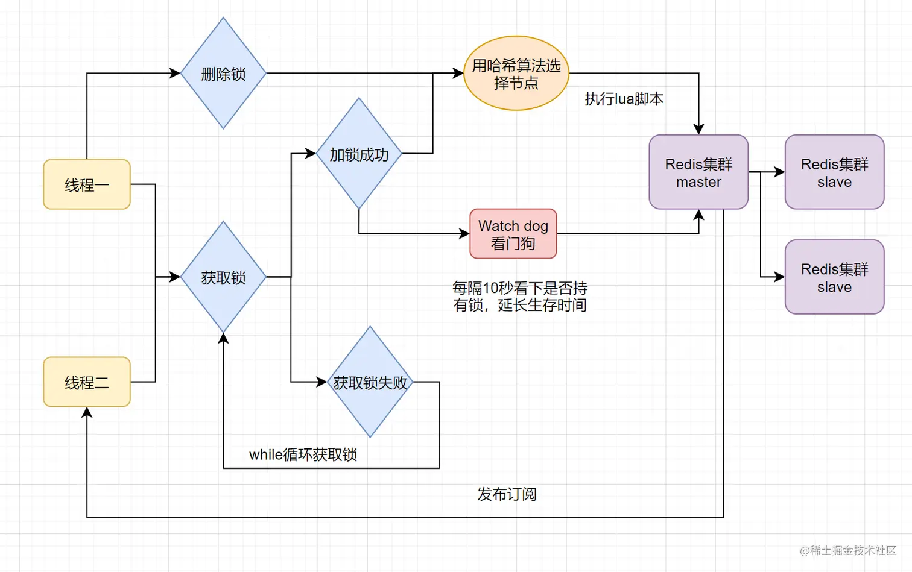
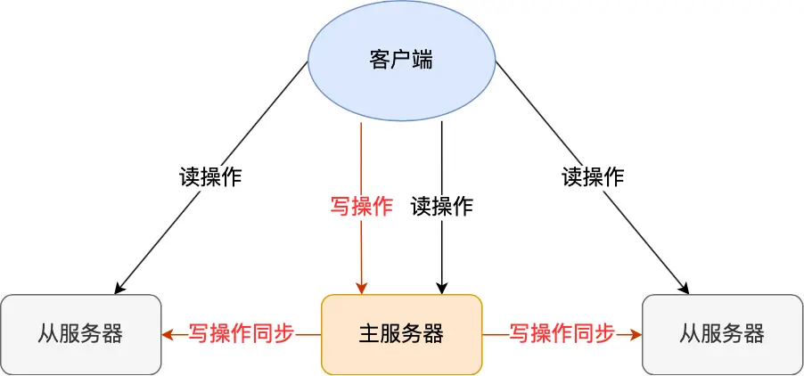
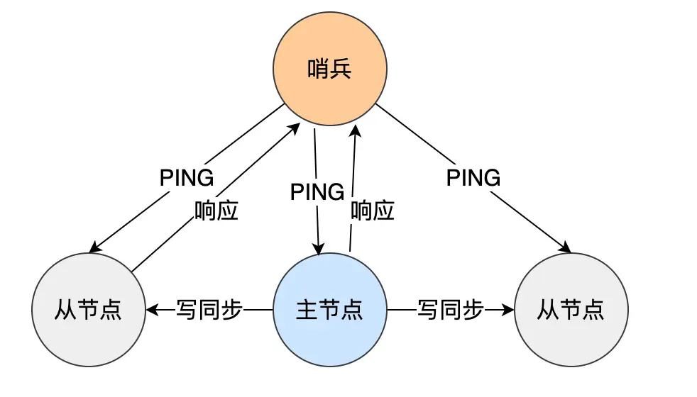

# Redis常见面试题&详解

## 你们项目中的Redis一般运用在什么场景中？有什么作用？

## Redis为什么这么快？

1. **内存存储：** Redis是将数据存储在内存当中的，而内存的IO速度比磁盘的IO速度快上几个数量级，因此Redis很快，同时基于内存也导致其存储空间有限。内存访问一次大概120ns（微秒），SSD 硬盘访问一次50-150us（纳秒），如果按照访问一次150us来算，性能差距在1000倍。这是因为1us等于1000ns。所以，150微秒是150,000纳秒，而120纳秒只是150微秒的一千分之一。

2. **数据结构：** Redis提供了多种数据结构，5种基础数据结构String、List、Hash、Set、ZSet，3中特殊结构HyperLogLog (布隆过滤器)、Geospatial (地理空间索引)、Bitmaps (位图)，这些数据结构都是Redis专门优化过的，支持高效的读写操作。

3. **非阻塞式IO：** Redis 基于 IO 多路复用实现了非阻塞式 IO，采用 IO 多路复用技术，并发处理连接。通过 epoll 模型和自己实现的简单的事件框架，将 epoll 中的读、写、关闭、连接都转化成了事件，然后利用 epoll 的多路复用特性，把 IO 操作时间优化到了极致。

4. **单线程模型：** Redis 把所有主线操作使用单线程模型，将网络 IO 以及指令读写全部交由一个线程来执行。 这样可以带来避免线程创建而导致的性能消耗，多线程上下文切换而引起的 CPU 开销，以及避免了多个线程之间的竞争问题，比如临界区资源的线程安全、锁的申请、释放以及死锁等问题。

## Redis有哪些数据结构？其实现原理是怎样的？

1. **字符串（String）**：字符串是最基本的数据结构，在 Redis 中以键值对的形式存储。字符串类型的值可以包含任何类型的数据，比如整数、浮点数、甚至是二进制数据。Redis 的字符串实现基于 **简单动态字符串（SDS）** 替换了传统字符串，内部有一个 len 字段记录了字符串长度：实现了 O(1) 复杂度的 strlen 操作，并保证了二进制安全性。以及 Redis 在内部针对区分了多种 SDS 类型，不同大小的字符串会对应不同的 SDS 实现，有效的节省内存。

2. **哈希表（Hash）**：哈希表在 Redis 中以键值对的形式存储，其中每个键都对应一个字段和一个值的映射。哈希表适用于存储对象类型的数据，比如用户信息、产品信息等。Redis 的哈希表实现采用了类似于 Java 的 HashMap 的数据结构，可以实现快速的查找、插入和删除操作。

3. **列表（List）**：列表是一种有序的数据结构，在 Redis 中以插入顺序存储。列表允许重复的值，并且支持在列表的两端进行插入、删除和查找操作，因此可以用于实现队列、栈等数据结构。Redis 的列表实现基于双向链表和压缩列表（当列表长度较短时）的数据结构，具有高效的插入、删除和索引操作。

4. **集合（Set）**：集合是一种无序且不重复的数据结构，在 Redis 中用于存储唯一的值。集合支持基本的集合运算，如交集、并集、差集等，并且可以快速地判断一个值是否存在于集合中。Redis 的集合实现基于哈希表，可以实现高效的插入、删除和查找操作。

5. **有序集合（Sorted Set）**：有序集合是集合的一种扩展，它在每个成员值上关联了一个分数（score），并且按照分数对成员进行排序。有序集合适用于需要按照特定顺序访问成员的场景，比如排行榜、优先级队列等。Redis 的有序集合实现基于跳跃表（Skip List）和哈希表，可以实现快速的插入、删除和按照分数范围进行查找的操作。

6. **位图（Bitmap）**：位图是一种特殊的数据结构，它以比特（bit）的形式存储数据。在 Redis 中，位图可以用于记录用户的在线状态、统计用户行为、进行布隆过滤器等。Redis 的位图实现使用字节数组来存储位，并提供了一系列位操作命令，如设置位、清除位、计数位等。

7. **HyperLogLog (布隆过滤器)：** 
HyperLogLog 是用于估计基数（集合中不同元素的数量）的算法。它能以极小的内存消耗来估计集合的基数，适合于对大规模数据进行近似统计分析，例如统计网站的独立访客数或唯一 IP 数等。在 Redis 中，您可以使用 HyperLogLog 数据结构来执行类似的操作。

8. **Geospatial (地理空间索引)：** 
Redis 的地理空间支持使得您可以将地理位置信息与键值存储在一起，并可以基于空间坐标执行范围查询。这允许您在 Redis 中构建地理信息系统（GIS）应用程序，例如位置服务、附近的商家搜索等。

## Redis宕机数据会丢失吗？

如果Redis没有开启任何的持久化机制，那么数据就会全部丢失，否则只会丢失部分数据，丢失数据的多少取决于采用的持久化配置。

Redis提供了两套持久化机制，RDB和AOF：

RDB会根据设置的情况定期去fork一个子进程，生成当前时间节点数据库的全量快照。如果在RDB快照完成之后出现宕机，那么会丢失掉快照生成期间的全部增量数据，如果在快照还没生成成功的时候宕机，则会丢失掉所有的数据。

AOF则会将每次执行的Redis命令追加到日志文件当中，然后恢复的时候根据日志文件中的指令记录来进行数据的恢复。但是AOF每次命令执行完毕之后数据会先被写入AOF缓存，再写入操作系统缓存，因此刷盘策略决定了Redis宕机的时候会丢失多少数据。

- Always：每执行一条指令就刷盘一次，最多会丢失一条指令
- Eversec：每分钟刷盘一次，宕机时最多丢失1s内的数据。
- No：不主动刷盘，由操作系统自己决定，宕机时最多丢失从上一次刷盘到本次刷盘的所有数据

## Redis的AOF机制是怎么实现的？

AOF 即 Append Only File，它是 Redis 提供的一种持久化机制。

其原理是每当服务器执行写指令时，将命令追加到 AOF 日志文件。当 Redis 重新启动时，他会在本地启动一个伪客户端，并按顺序重新发送日志中的命令以恢复数据。

Redis 的 AOF 日志和 MySQL 的 binlog 有点像，当执行一个命令后，数据会先写入AOF 缓冲区，再写入操作系统缓冲区，最后根据刷盘策略调用 fsync 函数将数据刷入磁盘。Redis 默认提供三种刷盘策略：Always（每个命令后都刷盘）、Everysec（每秒刷一次盘）、No（等到操作系统缓冲区满或定期刷盘）。

当 AOF 日志越来越大的时候，会触发 AOF 重写。举个例子，假如在 Redis 中对 1 递增了 99 次，那么 AOF 文件会记录一百条命令，但是实际上我们恢复数据的时候只需要一个最终值 100，中间的步骤都是不需要的。基于这个原理，在 Redis 重写的过程中，它会开启一个子进程扫描数据库，并生成一个新的 AOF 文件去替换旧的文件。这个文件将会比原本的文件精简，并且哪怕这个过程中 Redis 挂了，也不会影响已有的 AOF 文件。

不过，在子进程进行 AOF 重写的过程中，由于主进程还在不停的接受新的指令，因此它除了需要写自己的 AOF 缓冲区外，还需要将其写到 AOF 重写缓冲区中，以此实现重写过程中的增量数据同步。

## Redis的RDB机制是怎么实现的？

当通过 BGSAVE 指令生成 RDB 的时候，Redis 会 fork 出一个子进程，它会基于写时复制机制，在不阻塞主线程的情况下，将此刻的数据库全量数据保存为二进制快照。

具体的来说，在最开始的时候 fork 子进程的时候，操作系统会为其拷贝父进程的内存页，但是此时两者都指向同一块物理内存。当主进程发生写操作时，会真正的将父进程的数据拷贝到独立的物理内存中。此时父子进程的物理内存彼此独立，互不干涉，父进程继续处理增量数据，而子进程则根据拷贝出来的旧数据生成 RDB 快照。

相对 AOF，RDB 生成的二进制文件更小，数据恢复起来更快，并且整个流程中完全不会阻塞主进程，但是对应的，由于写时复制，在最坏的情况下可能会占用双倍内存，并且无法保存增量数据。

## Redis如何实现到期删除？

在 Redis 中，我们可以用 EXPIRE、PEXPIRE、EXPIREAT 和 PEXPIREAT四个命令来按毫秒或秒设置 key 的过期时间。其中，前两者指定的是 key 的有效时间，而后两者指定的是 key 的到期时间点。

这些时间最终会被转换为一个时间戳并，与 key 一一对应保存在一个到期字典中，然后 Redis 会根据 key 在到期字典中的到期时间，通过主动和被动两种方式清理到期的 key。

被动删除是指每次访问 key 键时，Redis 会检查 key 是否已到期，如果是就将其删除并返回空值。不过如果仅靠被动删除是不够的，因为如果 key 的访问频率不高，可能会导致一些数据一直不能被删除，内存也无法得到释放，因此所以还需要定期的主动删除。

主动删除是指 Redis 会每隔 10 秒主动扫描数据库，随机抽取 20 个 key 并删除其中已经到期的部分。然后，如果这次抽样中到期键的 key 的比例超过 25%，就会继续抽样，直到不满足条件或超时为止。

以上两种删除机制互相配合，基本能保证 Redis 中到期键的数量不会超过总数据量的 25%。

另外，Redis 在持久化的时候也会针对到期的 key 做额外的处理。Redis 在 AOF 的时候，如果 key 过期了，则会向文件追加一条 DEL 指令，而如果是在 AOF 重写和 RDB 的时候，则检查并直接忽略掉过期的 key。

最后是集群，在集群里面，当主节点发现 key 到期时，会向所有从节点发送 DEL 命令，但是当从节点发现键到期时，只会将其标记为已删除，直到收到主节点的删除指令才会真正删除，以确保数据一致性。

## Redis常用内存淘汰策略？

从淘汰范围来说可以分为不淘汰任何数据、只从设置了到期时间的键中淘汰和从所有键中淘汰三类。而从淘汰算法来分，又主要分为 random（随机），LRU（最近最少使用），以及 LFU（最近最不常使用）三种。

## Redis字符串底层数据结构？

在 Redis 中，没有使用 C 标准库提供的字符串，而是实现了一种名为简单动态字符串（SDS, Simple Dynamic String）的数据结构来表示字符串。

SDS 由长度（len）、内存空间大小（alloc）、字符串类型（flags）和存储的字节数组（buf）四个部分组成。相较于 C 标准库的字符串，它具备以下优点：

高效的长度计算：SDS 记录了字符串长度，因此获取字符串长度时可直接返回，无需遍历每个字符。
二进制安全：SDS 不需要根据 \0 特色字符判断字符串是否已经结束，因此可存储任何二进制数据，无需担心因为特殊字符引发异常。
高效修改的操作：SDS 记录了内存空间大小，因此写入时可计算剩余空间并决定是否自动扩容，结合追加字符串时的空间预分配和截取字符串时的惰性删除策略，最大程度的减少了修改时的内存重新分配次数。
节省内存：Redis 设计了五种不同类型的 SDS，每种对应某一大小范围的字符串，因此可以根据字符串的大小选择占用空间最少的 SDS 类型，并且不使用编译器的内存对齐，而是按实际大小分配内存。最大程度节省了内存。

## Redis压缩列表是什么？

Redis 的压缩列表是List、Hash 和 ZSet 这三种数据结构的底层实现之一。它由一段连续的内存块组成，每一小段内存都对应一个节点。相对传统的链表，它不使用指针而使用内存偏移量记录节点间的相对关系。

#1. 结构特点
压缩列表的头部记录了占用内存大小、尾节点位置与节点总数，而每个节点都记录了上一节点长度、编码格式和数据。这种简洁而紧凑的结构使其可以使用尽可能小的内存存尽可能多的数据，并且仍具备传统链表的正向与逆向遍历功能。

#2. 连锁更新
压缩列表的最大问题在于，当修改节点时需要一并修改后继节点记录的前驱节点的长度，当长度超过编码类型所支持的最大数值时，后继节点也需要重新分配内存以改变编码类型。依次类推，就会导致连锁更新。

#3. 紧凑列表
为了解决连锁更新问题，Redis 在后续计划引入紧凑列表（listpack）替代压缩列表。它与压缩列表一样，都是基于一块连续的内存实现的有序列表，但是它的节点只记录当前节点的长度，而不记录前驱节点长度。因此修改节点并不会触发连锁更新

## Redis跳表是什么？

跳表是 ZSet 的底层实现之一，它是一种包含多级链表的数据结构，它允许通过额外的索引层来实现快速查找，实现 O(logN) 的平均复杂度。

Redis 的跳表节点里面保存了 score 和 member，所有的节点都按照 score 排序，而当 score 相同时，会再按照 member 的字典顺序进行排序。

虽然理想情况下，跳表的相邻两层之间的节点数量比是 2:1 ，但是这样做会导致在操作时付出额外的代价重建索引，因此 Redis 的使用了一种随机算法来生成索引：生成一个 0 到 1 之间的随机数，然后判断是不是小于 0.25，如果是就加一层，然后继续重复这个动作，直到随机数大于 0.25 或者到了最大层高为止。

这个策略保证了高层节点相对较少而底层节点相对较多，进而保证了索引的节点密度会随着层级从底层往上逐渐减少。

相比起具有同样查找效率的二叉树，它占用的内存更小，对范围操作的支持更好，并且修改的代价更小，实现也更简单。

## Redis的ZSet底层是如何实现的？

1. 压缩列表
   在数据量比较小的时候，Redis 会使用压缩列表作为实现方式。具体条件如下：

当元素数量小于 zset-max-ziplist-entries 时（默认为 128）。
当每个元素大小都小于zset-max-ziplist-value 时（默认为 64 字节）。
压缩列表是一种类似于数组的数据结构，以一段连续的内存空间存储数据。每个节点都占用相邻一小段内存，节点之间通过内存偏移量而非指针记录相对位置。这种结构能以最少内存保存尽可能多的数据。不过，由于压缩列表结构的特殊性，对某个节点的修改可能会导致后续节点的级联更新。因此，Redis 在未来计划采用紧凑列表替代压缩列表。

具体参照：✅ Redis的压缩列表是什么？(opens new window)

#2. 跳表+字典
另一种实现方式是跳表+字典，这种实现用于处理较大的数据集。在这种实现方式中，Redis 使用跳表的节点保存指向 member 的指针和 score ，同时又使用了字典保存 member 和 score 之间的对应关系，以便同时实现高效的随机查找和范围查找。

回到跳表本身，它是一种多级链表数据结构，它通过额外的索引层实现快速查找，使查找和插入操作的复杂度为 O(logN)。跳表的层数会影响操作的效率，因此 Redis 使用了一种随机算法来生成节点的层高，从而保证索引层节点密度从底层到顶层逐渐减少。

相对于具有相似查找效率的二叉树，跳表占用的内存更少，对范围操作的支持更好，修改的代价更小，并实现更简单 。

## 什么是布隆过滤器？

布隆过滤器是一种数据结构，用于快速判断一个元素是否存在于一个集合中。它以牺牲一定的准确性为代价，换取了存储空间的极大节省和查询速度的显著提升。

具体来说，布隆过滤器包含一个位数组和一组哈希函数。位数组的初始值全部置为 0。在插入一个元素时，将该元素经过多个哈希函数映射到位数组上的多个位置，并将这些位置的值置为 1。

因为每个元素存储都是以位来存储，而不是字节，所以元素的占用空间非常小。

1 字节（Byte）= 8 位（Bit）在计算机科学中，数据存储的最小单位是位（Bit），而字节（Byte）则是一个常用的数据存储单位，通常由8个位组成。

在查询一个元素是否存在时，会将该元素经过多个哈希函数映射到位数组上的多个位置，如果所有位置的值都为 1，则认为元素存在；如果存在任一位置的值为 0，则认为元素不存在。

布隆过滤器的优点在于它可以高效地判断一个元素是否属于一个大规模集合，且具有极低的存储空间要求。如果存储 1亿元素，误判率设置为 0.001 也就是千分之一，仅需要占用 171M左右的内存。

缺点在于可能会存在一定的误判率。

它在实际应用中常用于缓存场景下缓存穿透问题，对访问请求做一个快速判断机制。使用布隆过滤器能够有效减轻对底层存储系统的访问以及缓存系统的存储压力。

但是布隆过滤器本身也存在一些“弊端”，那就是不支持删除元素。因为它是一种基于哈希的数据结构，删除元素会涉及到多个哈希函数之间的冲突问题，这样会导致删除一个元素可能会影响到其他元素的正确性。

总的来说，布隆过滤器是一种非常高效的数据结构，适用于那些可以容忍一定的误判率的场合。

## Redis节点CPU核数越高越好？

Redis 是单线程的，这意味着在任何给定时刻只能处理一个请求。

因此，它更侧重于单个核心的性能，而不是多核心。高速缓存访问和处理请求的速度可能会受到 CPU 速度的限制，而不是核心数。

当然，不能真的为 Redis 只分配 1 个核心，因为 Redis 除了主线程处理从客户端发起的读写请求外，还会有一些异步的处理，比如：持久化操作、主从复制等，所以推荐设置 2 核 CPU 即可。

我看了腾讯云 Redis 默认会为每个节点分配 2 核 CPU，1 个 CPU 负责主线程处理读写请求，另外 1 个 CPU 用于处理后台任务。

## Redis如何实现分布式锁？

**1、setnx、expired:** 先用setnx抢锁，抢到之后再使用expire来设置过期时间，防止锁忘记释放。问题在于setnx和expire **不是原子操作** ，如果执行完setnx加锁，执行expire的时候宕机，此时该锁将永远不会被释放。SETNX 是SET IF NOT EXISTS的简写.日常命令格式是SETNX key value，如果 key不存在，则SETNX成功返回1，如果这个key已经存在了，则返回0。

**2、使用lua脚本保证setnx、expire的原子性：** 为了解决方法1的问题，可以使用lua脚本来保证2个操作的原子性能。

**3、set扩展命令：set ex px nx** ：

Redis中Set的扩展指令SET key value[EX seconds][PX milliseconds][NX|XX]本身是保障原子性的，但是也存在问题见详解。

- NX :表示key不存在的时候，才能set成功，也即保证只有第一个客户端请求才能获得锁，而其他客户端请求只能等其释放锁，才能获取。

- EX seconds :设定key的过期时间，时间单位是秒。

- PX milliseconds: 设定key的过期时间，单位为毫秒

- XX: 仅当key存在时设置值

4、set ex px nx+校验唯一随机值，再释放锁

5、开源框架Redisson

只要线程一加锁成功，就会启动一个watch dog看门狗，它是一个后台线程，会每隔10秒检查一下，如果线程1还持有锁，那么就会不断的延长锁key的生存时间。因此，Redisson就是使用Redisson解决了锁过期释放，业务没执行完问题。

[redis实现分布式锁详解](https://juejin.cn/post/6936956908007850014)

# Redis集群相关
## Redis是如何实现高可用的？

主从复制是 Redis 高可用服务的最基础的保证，实现方案就是将从前的一台 Redis 服务器，同步数据到多台从 Redis 服务器上，即一主多从的模式，且主从服务器之间采用的是「读写分离」的方式。

主服务器可以进行读写操作，当发生写操作时自动将写操作同步给从服务器，而从服务器一般是只读，并接受主服务器同步过来写操作命令，然后执行这条命令。

也就是说，所有的数据修改只在主服务器上进行，然后将最新的数据同步给从服务器，这样就使得主从服务器的数据是一致的。

## Redis 集群模式的工作原理？
## Redis哨兵模式？

在使用 Redis 主从服务的时候，会有一个问题，就是当 Redis 的主从服务器出现故障宕机时，需要手动进行恢复。

为了解决这个问题，Redis 增加了哨兵模式（Redis Sentinel），哨兵模式做到了可以监控主从服务器，并且提供主从节点故障转移的功能。

哨兵其实是一个运行在特殊模式下的 Redis 进程，所以它也是一个节点。从“哨兵”这个名字也可以看得出来，它相当于是“观察者节点”，观察的对象是主从节点。

## Redis切片集群模式？

## Redis集群脑裂导致数据丢失怎么办？

