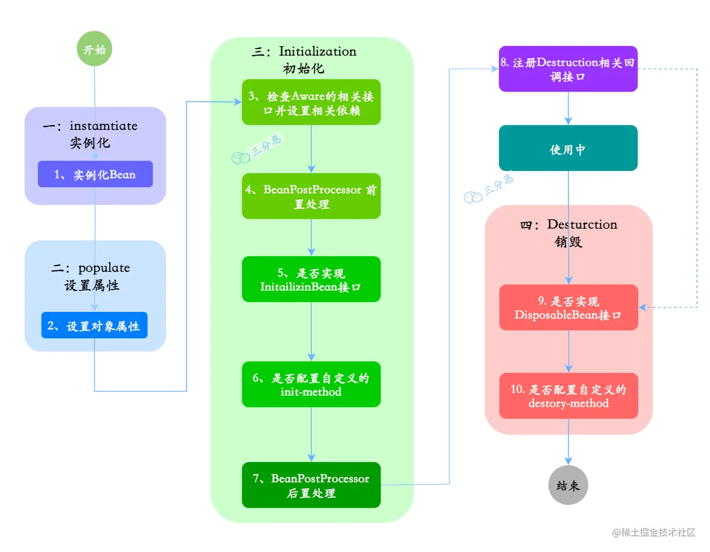

## 微众银行面经(offer已拿)
### 微众银行一面(电话面试)：

上午11点10电话面试，持续时间大概23分钟，问题如下

#### 1.自我介绍，项目
#### 2.项目中的难点，怎么解决的
#### 3.项目中有没有用到新技术
#### 4.最近有没有做什么项目
#### 5.怎么判断一个字符串中的大小写字母，不用系统自带函数
#### 6.如何将一个字符串中的大写字母转化成小写字母，不用系统自带函数
#### 7.方法覆盖和重载的区别
#### 8.==和equals的区别
#### 9.同一个类的两个对象的hashcode一样吗
#### 10.数据库的索引
#### 11.表内连接和外连接区别？
表内连接（Inner Join）和外连接（Outer Join）是关系型数据库中常用的连接操作，用于在两个或多个表之间基于某些条件关联数据。它们的主要区别在于对于无法匹配的数据行的处理方式。

1. **内连接（Inner Join）：**
   内连接返回满足连接条件的行，即两个表中连接列的值相等的行。如果在其中一个表中没有对应的匹配行，则这些行不会包含在结果中。内连接的结果集仅包含符合连接条件的行。

   示例 SQL 查询语句：
   ```sql
   SELECT column1, column2
   FROM table1
   INNER JOIN table2 ON table1.columnX = table2.columnY;
   ```

2. **外连接（Outer Join）：**
   外连接则会返回满足连接条件的行，同时还会包括未匹配到的行。外连接分为左外连接、右外连接和全外连接：

    - **左外连接（Left Outer Join）：** 返回左表中的所有行，以及右表中与左表匹配的行。如果右表中没有匹配的行，则结果集中右表的列值为 NULL。

    - **右外连接（Right Outer Join）：** 返回右表中的所有行，以及左表中与右表匹配的行。如果左表中没有匹配的行，则结果集中左表的列值为 NULL。

    - **全外连接（Full Outer Join）：** 返回左表和右表中的所有行，如果没有匹配的行，则对应的列值为 NULL。

   示例 SQL 查询语句（左外连接）：
   ```sql
   SELECT column1, column2
   FROM table1
   LEFT OUTER JOIN table2 ON table1.columnX = table2.columnY;
   ```

表内连接通常用于获取两个表中相关联的数据，而外连接则更适合于需要包括未匹配数据行的情况，例如对缺失数据的分析或报告生成。

#### 12.32位系统和64位系统int类型各占几个字节（都是4个字节，我竟然回答一个2字节，一个4字节，，，）
#### 12.什么时候会出现内存溢出（堆、栈、大数组、老年代）
#### 说说你知道的jvm启动参数？

Java虚拟机（JVM）的启动参数是用来配置和调整JVM运行时行为的设置。这些参数可以影响内存管理、垃圾回收、性能调优等方面。以下是一些常见的JVM启动参数：

1. **-Xmx**: 设置JVM堆的最大内存大小。例如，`-Xmx4g`表示将堆的最大内存设置为4GB。

2. **-Xms**: 设置JVM堆的初始内存大小。例如，`-Xms256m`表示将堆的初始内存设置为256MB。

3. **-Xss**: 设置每个线程的栈大小。默认值取决于操作系统。例如，`-Xss1m`表示将每个线程的栈大小设置为1MB。

4. **-XX:PermSize** 和 **-XX:MaxPermSize**: 用于设置永久代（PermGen）的初始大小和最大大小。在JDK8及以上版本中，永久代已被元数据区（Metaspace）取代，因此这些参数在较新的JVM版本中已经失效。

5. **-XX:MaxMetaspaceSize**: 设置元数据区（Metaspace）的最大大小。例如，`-XX:MaxMetaspaceSize=256m`表示将元数据区的最大大小设置为256MB。

6. **-XX:NewSize** 和 **-XX:MaxNewSize**: 设置新生代的初始大小和最大大小。通常与 -Xmx 一起使用以调整堆的分配策略。

7. **-XX:SurvivorRatio**: 设置Eden区与Survivor区的大小比例。默认值为8，表示Eden区和每个Survivor区的大小比为8:1。

8. **-XX:+UseParallelGC** 和 **-XX:+UseConcMarkSweepGC**: 分别启用并行垃圾回收器和并发标记清除垃圾回收器。

9. **-XX:+PrintGCDetails** 和 **-XX:+PrintGCDateStamps**: 打印GC日志的详细信息和日期时间戳。

10. **-XX:MaxGCPauseMillis**: 设置期望的最大GC停顿时间。垃圾回收器将尽量使停顿时间控制在指定的毫秒数内。

这些只是一小部分常见的JVM启动参数，实际上还有很多其他参数可供选择，具体选择哪些参数取决于应用程序的需求以及系统的配置。

#### Spring容器的初始化流程？


#### Spring bean的生命周期？



1、实例化：实例化一个 Bean 对象，Spring容器会从.xml文件、Java文件中读取Bean的定义，并使用反射创建一个JavaBean对象的实例。

2、属性赋值：为 Bean 设置相关属性和依赖

3、初始化：初始化的阶段的步骤比较多，5、6步是真正的初始化，第 3、4 步为在初始化前执行，第 7 步在初始化后执行，初始化完成之后，Bean就可以被使用了

4、销毁：第 8~10步，第8步其实也可以算到销毁阶段，但不是真正意义上的销毁，而是先在使用前注册了销毁的相关调用接口，为了后面第9、10步真正销毁 Bean 时再执行相应的方法

#### Spring事务传播行为和隔离级别？

#### mysql间隙锁？

#### innodb和myisam区别？

#### ApplicationContext是什么了解吗？

#### Null和""在数据库区别

#### MySQL未命中索引怎么办？

#### 双亲委派机制

#### MySQL事务隔离级别，脏读、幻读、可重复读，以及实现原理？

#### 如何减少JVM的GC频率？

#### Java的内存区域及其作用？

#### 哪些地方可能发生OOM？

explain分析，是索引失效还是走错了索引，然后展开了下回表，索引下推之类的

#### JavaWeb三大组件servlet, filter, listener？

（listener：监控各个servlet上下文，filter: 过滤外部请求，servlet: 接到url请求后做的一系列处理，比如doget,dopost，先后顺序是LFS(理发师)参考链接：https://www.jianshu.com/p/ec0a382c3d2c）

#### 了解哪些设计模式？

### 微众银行二面(视频面试)：
上午10:40左右QQ视频面试，两个面试官，不过视频一直卡顿，有的时候听不清，面试体验不是很好，问题如下
#### 1.一分钟自我介绍？
#### 2.本科还是研究生？问一下基础方面的吧，说一下Java类的修饰符，成员变量，方法的修饰符，区别
#### 3.多态的体现？重写与重载的区别？
#### 4.抽象类和接口区别，一个类如果继承了父类，还能实现接口吗
#### 5.String类里有哪些方法？

#### 6.场景题：在文件上传下载模块中，怎么实现一堆文件存储
答：存到服务器磁盘里，为了减轻检索压力，可采用分治法，建立多个文件夹
追问：你怎么让文件有序的存储在不同的文件夹里
答：文件记录有个主键，按主键标号的范围来存储在不同的文件夹中
追问：如果没有这个标号，就纯粹的文件，你怎么识别这些不同的文件
答：没这样干过啊，，没有自己生成过标号
7.你有没有linux开发经验（没有，，都是windows下开发，linux装过，会一些基本指令）
8.你是实习？可实习的时间？手上还有其他offer吗（说了一下手里的offer），面试官介绍了一些微众是干嘛的，说他们的工作挺有趣的，主要是java和python，
9.你还有啥想问的
总结：java基础难度不大，场景题回答的不理想，测评已做，等hr通知

微众银行hr面(电话面试):
1.自我介绍
2.导师让你们出来实习嘛，师门里一届有几个人？有想做测试的么（怎么就扯到测试了，，）
3.家是哪里的，以后想在哪边发展，
4.手上还有其他offer吗？（说了一下）
5.对比一下你手上的offer的优势与劣势（，，，第一次遇到）
6.微众银行呢？你还没分析
7.面试官有跟你说我们这边是什么岗位吗？有没有工具开发的经验（没有，，）
8.你还有什么想问的？
答：啥时候发书面通知的offer啊
hr答：就这几天，10号之前。